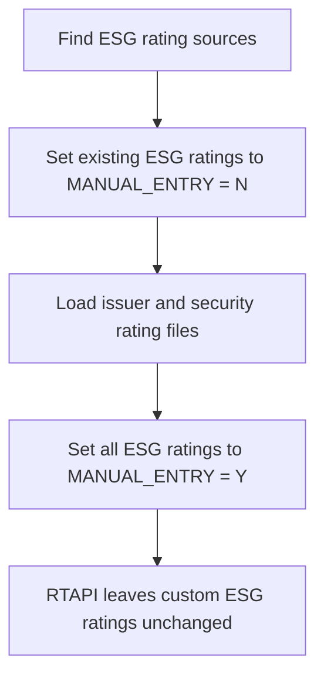

# Charles River Custom ESG Rating Integration

## Purpose

This document summarizes how custom environmental, social, and governance (ESG) ratings were configured and loaded into Charles River Development (CRD), including the interaction with the Bloomberg Real-Time API (RTAPI) integration.

The key operational concern is protecting custom ESG rating records from being overwritten or deleted by RTAPI, which manages ratings received from Bloomberg.

## Rating Configuration

### Rating sources

`CSM_RATING_SOURCE` defines rating sources that can be used at either the issuer or security level. These are also referred to as **CSM Rating Sources** or simply **Rating Sources**.

The `GRP_TYP_CD` (**group type code**) column can be used to classify related rating sources. For the custom ESG implementation, `GRP_TYP_CD` was set to `ESG`. This made it possible to identify all rating sources—and consequently the issuer and security rating records—associated with ESG factors.

### Rating definitions and allowable values

`CSM_RATER_RATING` defines the rating codes or values available for a particular rater or source. The relevant source identifier is `RATER_CD` (**rater code**).

Charles River supports flexible, user-defined rating types and values, including:

- Boolean values, such as true or false
- Numeric values
- Categorical rating codes
- Numeric ranges or buckets using fields such as `RATING_MIN` and `RATING_MAX`

This flexibility allows custom ESG factors to represent classifications created from internal research and client-specific requirements rather than ratings supplied by a standard market-data provider.

## Rating Data Tables

Custom ratings can be stored at two levels:

| Level | Table | Entity identifier | Description |
| --- | --- | --- | --- |
| Issuer | `CSM_ISSUER_RATING` | `ISSUER_CD` | Stores rating values associated with a Charles River issuer. |
| Security | `CSM_SECURITY_RATING` | `SEC_ID` | Stores rating values associated with a Charles River security. |

Each rating record also identifies its source through its rater code. Operationally, the record is therefore located using the entity identifier together with the applicable rating source or rater code.

## Bloomberg RTAPI Integration

RTAPI (**Real-Time API**) is a Charles River integration with Bloomberg. Out of the box, it can maintain ratings from recognized providers such as:

- Moody's
- Fitch
- S&P

RTAPI does not infer that a rating record is custom or ESG-related merely from its rater code or from the `ESG` value in `CSM_RATING_SOURCE.GRP_TYP_CD`. Its treatment of an issuer or security rating is controlled by the `MANUAL_ENTRY` flag on the rating record.

### `MANUAL_ENTRY` behavior

`MANUAL_ENTRY` can contain the following values:

| Value | Effective behavior |
| --- | --- |
| `Y` | Treat the record as manually maintained; RTAPI must not update or delete it. |
| `N` | Allow RTAPI to manage the record. |
| `NULL` | Also allow RTAPI to manage the record. |
| Any value other than `Y` | Effectively allows RTAPI to manage the record. |

The important rule is therefore:

> Only `MANUAL_ENTRY = 'Y'` protects a custom rating record from RTAPI.

## Failure Mode Discovered

When custom ESG issuer ratings were initially updated intraday without setting `MANUAL_ENTRY` to `Y`, a subsequent RTAPI run deleted them.

The records did not exist in Bloomberg because they represented custom ESG factors created by another team from research and client requirements. From RTAPI's perspective, they were therefore rating records under its control that were no longer present in the Bloomberg source.

After the update logic was corrected to write `MANUAL_ENTRY = 'Y'`, the ESG rating records survived subsequent RTAPI processing as expected.

## Batch-Load Input

The batch process consumed separate issuer- and security-rating files. At the file-contract level, each row was uniquely identified by the entity identifier together with `RATER_CD`.

### File keys

| Load type | Composite primary key | Description |
| --- | --- | --- |
| Issuer rating | `ISSUER_CD` + `RATER_CD` | Identifies the rating source for a particular Charles River issuer. |
| Security rating | `EXT_SEC_ID` + `RATER_CD` | Identifies the rating source for a security using its external security identifier. |

`EXT_SEC_ID` (**external security ID**) is the security identifier supplied by the load file. It is distinct from the internal Charles River `SEC_ID` used by `CSM_SECURITY_RATING`; the load process resolves the external identifier to the applicable Charles River security.

### Common load fields

In addition to its composite key, each issuer- or security-rating row could contain the following fields:

| Field | Required behavior or use |
| --- | --- |
| `RATING_CD` | The actual Charles River rating code. It can be supplied explicitly as an override or left `NULL` so that the rating is derived from `VENDOR_VALUE`. |
| `LONG_SHT_CD` | Long/short code. It was not used by this implementation and was left blank or `NULL`. |
| `MANUAL_ENTRY` | Indicates whether the record is protected from RTAPI. The load supplied `Y` or `N`; custom ESG records ultimately needed to be stored as `Y`. |
| `VENDOR_VALUE` | The raw source value from which the configured rating logic can derive `RATING_CD`. |
| `RATING_DATE` | Effective date of the rating. A `YYYY-MM-DD` value can be supplied, or a timestamp containing time components can be supplied and cast to a database date. |

`ISSUER_CD` is the Charles River issuer identifier. For security loads, `EXT_SEC_ID` is the external identifier presented by the input file, whereas `SEC_ID` is the corresponding internal Charles River security identifier used in the target rating data.

## Explicit and Derived Rating Codes

The load supported two ways to determine `RATING_CD`.

### Feed and translation configuration

The generic rating load was configured through `IMP_FEED_COLUMN` (**import feed column**) and `CSM_TRANSLATION`.

Relevant `CSM_TRANSLATION` fields included:

| Field | Meaning |
| --- | --- |
| `TRADE_SYST_CD` | Trade system code |
| `DATA_TYP` | Data type |
| `TRADE_FLD_CD` | Trade field code |

`IMP_FEED_COLUMN` identified the input columns as rating-related fields and supplied the configured transformation used during import. The translation expression could invoke the Charles River-provided `ratingCd` function with `RATER_CD` and `VENDOR_VALUE` to resolve the corresponding configured rating code.

The effective conditional logic was:

```text
if(isEmpty(RATING_CD), ratingCd(RATER_CD, VENDOR_VALUE), RATING_CD)
```

In other words:

- If the incoming `RATING_CD` was empty, call `ratingCd` to derive it from `RATER_CD` and `VENDOR_VALUE`.
- If the incoming `RATING_CD` was populated, use it directly as an override.

### Explicit rating code

When the input row supplied `RATING_CD`, the load used that value directly. This acted as an explicit override of the derivation logic.

### Rating derived from vendor value

When `RATING_CD` was `NULL`, the load passed `VENDOR_VALUE` through a rating-resolution function. The function applied the configuration associated with the specified `RATER_CD` and selected the appropriate rating code or bucket.

For numeric vendor values, this could use configured `RATING_MIN` and `RATING_MAX` values to map the raw value into the appropriate range. Conceptually, the selection logic was:

1. Use the supplied `RATING_CD` when it is present.
2. Otherwise, evaluate `VENDOR_VALUE` against the rating definitions for `RATER_CD`.
3. Return the rating code associated with the matching configured value or numeric bucket.

This provided useful flexibility: a producer could either make the classification itself and submit the final rating code, or submit a raw vendor value and allow the centralized Charles River configuration to classify it.

### Metadata-driven extensibility

Once this generic rating-feed configuration was in place, a producer could submit an array of rater codes and associated values and allow the same import path to process every entry. Adding another configured rating source did not require another purpose-built field mapping or a new code path.

This was substantially simpler than loading equivalent information through user-defined fields (UDFs) or other custom field types, which commonly required additional per-field configuration. The reusable rating model separated responsibilities cleanly:

- `CSM_RATING_SOURCE` classified and described the rating sources.
- `CSM_RATER_RATING` defined the allowable codes and value ranges for each source.
- `IMP_FEED_COLUMN` and `CSM_TRANSLATION` defined the reusable import transformation.
- The input supplied only the entity identifier, `RATER_CD`, and either an explicit `RATING_CD` or a `VENDOR_VALUE`.
- The `ratingCd` function applied the central configuration consistently.

The result was a one-time integration mechanism with data-driven extension: new rater/value pairs flowed through the existing load without repetitive UDF-style setup.

## Supported Rating and Bucket Patterns

The implementation supported both exact-match categorical ratings and numeric range-based ratings.

### Exact-match categorical ratings

String-based ratings had an explicit set of allowable values. The incoming value had to match exactly one configured value; the load did not perform fuzzy, partial, or similarity matching.

Examples included:

- `Yes` or `No`
- `True` or `False`
- `Pass`, `Fail`, or `Watch List`
- `Green`, `Yellow`, `Orange`, or `Red`
- `Needs to Improve`, `Substantial Compliance`, or `Non-Compliance`
- `Strong Evidence`

An unrecognized spelling, alternate wording, or otherwise unconfigured value was rejected rather than coerced to the nearest configured rating. Fuzzy normalization could be considered as a future upstream capability, but it was deliberately not part of this rating-resolution behavior.

### Numeric range ratings

A min/max classification indicated that the rating was numeric. In that case, the raw `VENDOR_VALUE` was evaluated against `RATING_MIN` and `RATING_MAX`, using the lower-inclusive and upper-exclusive interval behavior described below, to select the corresponding configured `RATING_CD`.

## Composite Ratings from Multiple API Values

Some rater codes represented a derived numeric value assembled from multiple API data points. For example, one `RATER_CD` could contain the sum of two, three, or four source categories, while each constituent category could also be published independently under its own rater code.

The derived rater code had an **all-or-nothing completeness rule**:

- Every expected constituent had to be present before the aggregate was calculated and emitted.
- If even one required constituent was missing, the aggregate rater code was not populated.
- Available constituents could still populate their own independent rater codes when applicable.
- Missing values were not treated as zero because doing so would create a plausible but incomplete and misleading rating.

The ETL implemented this rule while grouping the source API data into the Charles River import structure. Conceptually, the aggregate was eligible only when:

```text
actual constituent count = expected constituent count
```

For an aggregate requiring three values, two available values were therefore insufficient: no aggregate row was emitted. The grouped logic validated the expected constituent count before applying the sum and generating the aggregate rater/value pair.

Where duplicate source rows were possible, this validation should be based on the distinct required constituent identifiers—not merely the raw row count—so that a duplicate cannot disguise a missing component.

## Validation and Incremental Deployment

The configuration also acted as an enforced domain boundary. `CSM_RATER_RATING` defined the allowable rating codes and, where applicable, the numeric buckets available for each configured rating source.

An incoming rating record was rejected when:

- It supplied an explicit `RATING_CD` that was not configured as an allowable value for the specified `RATER_CD`.
- It supplied a `VENDOR_VALUE` that the `ratingCd` function could not map to a configured rating code or bucket.
- The referenced rating source itself had not yet been configured in Charles River.

The invalid record did not silently populate an unsupported value, nor did it disappear without an observable outcome. The load produced an error that operations could detect, investigate, and remediate.

### Preferred rollout sequence

This behavior supported a safe, incremental configuration-first deployment:

1. Add the new rating source to `CSM_RATING_SOURCE`.
2. Define its allowable codes or numeric buckets in `CSM_RATER_RATING`.
3. Validate the configuration and `ratingCd` resolution behavior in Charles River.
4. Update the extract, transform, and load (ETL) producer to emit the new `RATER_CD` and its explicit `RATING_CD` or `VENDOR_VALUE`.
5. Monitor the import results and remediate any rejected records.

This order allows the Charles River configuration to be deployed before the upstream data begins arriving. Once the ETL starts emitting the new rater/value pairs, they flow through the existing generic rating import without another integration change.

Reversing the order is fail-safe but operationally noisy: if the ETL emits a new source or rating code before Charles River is configured to recognize it, the affected records are rejected and surfaced for remediation. That explicit failure is preferable to silently accepting invalid domain values or silently discarding data.

### Numeric bucket boundaries

Numeric rating buckets use a **lower-bound-inclusive, upper-bound-exclusive** interval:

```text
RATING_MIN <= VENDOR_VALUE < RATING_MAX
```

In interval notation, each bucket is `[RATING_MIN, RATING_MAX)`. A value equal to `RATING_MIN` belongs to that bucket, while a value equal to `RATING_MAX` does not; it belongs to the next bucket up.

For example, given adjacent buckets `[0, 10)` and `[10, 20)`:

- `9.99` belongs to `[0, 10)`.
- `10` does not belong to `[0, 10)`; it belongs to `[10, 20)`.
- `20` belongs to neither of these buckets and would require a subsequent bucket beginning at `20`.

Focused tests should still cover:

- A value immediately below the boundary
- A value exactly equal to the boundary
- A value immediately above the boundary
- Adjacent buckets that share the same boundary value
- Values below the lowest and above the highest configured ranges

The configuration and resolution function should also be validated to ensure that adjacent buckets do not contain gaps and that an unmatched value produces an explicit, observable result rather than a silent misclassification.

## Batch-Load Workflow

The batch process used the `ESG` group classification to identify all relevant rating sources and temporarily change how their rating records were treated during the load.

1. **Identify ESG rating sources.** Query `CSM_RATING_SOURCE` for sources where `GRP_TYP_CD = 'ESG'`.
2. **Pre-load step.** Set `MANUAL_ENTRY = 'N'` on the applicable existing ESG records in both `CSM_ISSUER_RATING` and `CSM_SECURITY_RATING`.
3. **Load the batch files.** Apply issuer ratings using `ISSUER_CD` + `RATER_CD`, and security ratings using `EXT_SEC_ID` + `RATER_CD`. Use an explicit `RATING_CD` when supplied; otherwise derive it from `VENDOR_VALUE`.
4. **Post-load step.** Reset `MANUAL_ENTRY = 'Y'` on all applicable ESG issuer and security rating records.
5. **Return to protected state.** Subsequent RTAPI runs leave the custom ESG records unchanged, even though the corresponding factors do not exist in Bloomberg.



## Operational Invariants

The implementation depends on the following invariants:

- Every custom ESG rating source must be classified with `GRP_TYP_CD = 'ESG'`.
- Every custom ESG issuer and security rating must end the batch process with `MANUAL_ENTRY = 'Y'`.
- The post-load protection step must run even if the main load partially fails.
- RTAPI must not run during the interval in which the ESG records temporarily have `MANUAL_ENTRY = 'N'`, unless that interaction is explicitly intended and controlled.
- Validation should check for any ESG record whose `MANUAL_ENTRY` value is `NULL`, `N`, or otherwise not `Y` after processing.

## Recommended Validation and Recovery Controls

The post-load process should record or verify at least the following:

- Number of ESG issuer-rating records changed to `N` before the load
- Number of ESG security-rating records changed to `N` before the load
- Number of issuer and security records inserted, updated, or deleted by the load
- Number of ESG records restored to `Y`
- Count of remaining ESG records where `MANUAL_ENTRY <> 'Y'` or is `NULL`
- Load status, timestamps, source filename, and correlation or run identifier

Because an interruption between the pre-load and post-load steps leaves custom records exposed to RTAPI, the post-load protection operation should be idempotent and independently rerunnable. A recovery procedure should be able to set all applicable ESG records back to `MANUAL_ENTRY = 'Y'` without repeating the complete data load.

## Configuration Ownership Across Charles River and ICP

The integration required configuration that extended beyond Charles River's native rating model. Charles River could represent rating sources, allowable rating values or buckets, issuer lists, and the resulting issuer or security ratings. It did not provide an apparent supported mechanism for attaching all of the external API and mapping metadata required by the integration.

That additional metadata included:

- External API endpoint and dataset names
- Source field names to request or extract from each endpoint
- Mappings from external fields to Charles River `RATER_CD` values
- Rules for combining multiple source fields into a derived rater value
- Expected constituent counts for composite ratings
- Other processing information required by the batch and real-time applications

This configuration was therefore stored and managed in the Investment Compliance Platform (ICP) database. Both the batch and real-time ingestion applications consumed the same ICP configuration when retrieving ESG factors and translating them into Charles River ratings.

### Recommended source-of-truth model

Rather than claiming that one physical system owns every aspect of the configuration, the recommended model is **one authoritative owner per configuration concern**:

| Configuration concern | Authoritative system |
| --- | --- |
| Charles River rating-source identity and classification | Charles River |
| Allowable rating codes and numeric buckets | Charles River |
| Issuer lists and other CRD-native rating configuration | Charles River |
| API endpoint and dataset definitions | ICP |
| External source-field definitions | ICP |
| External-field-to-`RATER_CD` mappings | ICP |
| Composite-rating membership and completeness rules | ICP |
| Batch and real-time processing metadata | ICP |

`RATER_CD` serves as the stable contract joining the integration metadata in ICP to the corresponding rating definition in Charles River.

This is a federated source of truth rather than a single physical source of truth, but it avoids duplicating ownership of the same fact. A unified administrative view could present the combined configuration to users while still writing each concern to its authoritative store.

### Relational configuration rather than a JSON metadata field

The ICP-owned metadata should remain explicitly modeled in relational tables rather than placed in a general-purpose JSON column. The important relationships—datasets, source fields, rater mappings, composite constituents, and expected counts—benefit from:

- Foreign keys and uniqueness constraints
- Required-field and data-type validation
- Queries that expose incomplete or conflicting mappings
- Auditable, field-level changes
- Effective dating or versioning
- User-facing administrative screens
- Deployment and environment comparisons

A JSON document could be useful only for genuinely provider-specific properties that cannot yet be modeled predictably. It should not become the primary representation for known configuration concepts.

### Shared consumption by batch and real-time processing

The real-time process ran in AWS Lambda and used the ICP configuration to translate incoming API data into the applicable Charles River rater codes and values.

The batch process also used AWS Lambda, orchestrated by AWS Step Functions. The state machine coordinated multiple processing steps, allowing independent jobs to run in parallel while dependency-sensitive jobs ran sequentially, with checkpoints between stages.

Having both paths consume the same relational configuration reduced the risk that batch and real-time processing would interpret the same ESG source differently.

### Cross-system consistency controls

Because configuration is necessarily split across ICP and Charles River, validation should detect drift before production data is emitted. Useful checks include:

- Every active ICP mapping references a `RATER_CD` configured in Charles River.
- Every mapped categorical value is an allowable Charles River rating code.
- Every numeric mapping resolves to a complete, non-overlapping set of configured buckets.
- Every composite mapping has the declared number and identity of required constituents.
- Deprecated Charles River sources are not referenced by active ICP mappings.
- Batch and real-time applications read the same active configuration version.

Ideally, these checks run during configuration deployment and as a periodic reconciliation, with visible errors that identify the mismatched source, field, or rater code.

## Future Investigation

Two alternative integration and ownership approaches may be worth investigating in a future project.

### A separate real-time rating integration

One option would be to determine whether a custom integration could be built using a model similar to the Bloomberg RTAPI integration. Instead of loading custom ESG ratings through the batch import path, the internal rating source could potentially behave as a first-class real-time provider.

Questions to evaluate would include:

- Whether Charles River exposes a supported extension point or API for another real-time rating provider
- Whether such an integration would use the same rating-source and allowable-value configuration
- How the integration would declare record ownership and coexist with Bloomberg RTAPI
- Whether it would support replay, idempotency, deletion semantics, and recovery
- Whether the lower latency would justify the additional operational and vendor-specific complexity

This should not be assumed to be supported merely because Bloomberg RTAPI exists; it would require confirmation against the applicable Charles River version, licensed capabilities, and vendor documentation.

### Finer-grained RTAPI ownership or exclusions

In the implemented solution, `MANUAL_ENTRY = 'Y'` was the verified mechanism for preventing RTAPI from updating or deleting custom ESG rating records. A future investigation could determine whether RTAPI offers other configurable controls that can:

- Include or exclude particular `RATER_CD` values
- Restrict management to specified rating sources or providers
- Distinguish Bloomberg-owned records from internally owned records
- Apply ownership rules through other fields on `CSM_ISSUER_RATING` or `CSM_SECURITY_RATING`
- Prevent deletion of records outside RTAPI's authoritative scope without relying on the manual-entry flag

The issuer- and security-rating tables contain additional fields that were not used or evaluated in this implementation. Their presence should not be interpreted as evidence that they control RTAPI behavior. Any alternative would need to be verified through version-specific documentation, vendor guidance, and controlled tests covering insert, update, and deletion behavior.

Until such behavior is demonstrated, `MANUAL_ENTRY = 'Y'` remains the known protection mechanism for custom ratings.

## Summary

Charles River's configurable rating model supported custom issuer- and security-level ESG factors through `CSM_RATING_SOURCE`, `CSM_RATER_RATING`, `CSM_ISSUER_RATING`, and `CSM_SECURITY_RATING`. The critical integration detail was that RTAPI did not distinguish custom ESG records based on their rating-source configuration. Only `MANUAL_ENTRY = 'Y'` protected those records from Bloomberg-driven updates or deletion.

The batch process therefore temporarily marked the relevant records as non-manual for loading and then restored them to manual status. Correctness depended not only on loading the new values, but also on reliably returning every custom ESG record to its protected state before RTAPI could process it.
