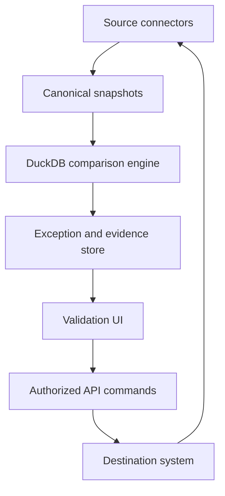

# Architecture Lab Proposal: DuckDB Data Reconciliation Workbench

## Status

Proposed

## Summary

Build a reusable data reconciliation workbench for validating the movement and
transformation of business data across operational databases, generated files,
application programming interfaces (APIs), and destination systems.

The lab will use DuckDB as an embedded analytical engine to compare multiple
representations of the same business facts. A user interface will explain and
classify discrepancies, preserve evidence, and optionally initiate controlled,
logged, and auditable corrections through a business API.

The larger architectural objective is to create an incremental path from opaque
batch processing toward observable, recoverable, and eventually real-time data
flows. Batch reconciliation remains valuable as a control even after real-time
updates are introduced.

## Motivation

An extract, transform, and load process can complete successfully while still
producing incorrect or incomplete business results. Records may be omitted,
duplicated, transformed incorrectly, rejected by an intermediate system, or
accepted by an API without reaching the intended destination tables.

A representative workflow contains at least three observable stages:

1. Data prepared in an operational or aggregation database.
2. Data written to a file for import into a downstream system.
3. Data accepted and persisted in the downstream system's final tables.

Existing validation scripts often solve one immediate comparison but couple
source access, normalization, business rules, and reporting. This makes them
difficult to generalize, operate consistently, or extend into controlled
remediation.

This lab will separate those responsibilities and treat reconciliation as a
first-class architectural capability.

## Goals

- Compare data across databases, APIs, and files using stable business keys.
- Normalize different physical representations into canonical datasets.
- Define reconciliation policies separately from extraction and execution.
- Detect missing, unexpected, duplicated, stale, and mismatched records.
- Preserve immutable evidence for every validation run.
- Explain discrepancies through a usable, drillable interface.
- Distinguish expected differences from actionable problems.
- Support authorized corrections through an API without directly editing the
  destination database.
- Verify that requested corrections reached the final destination state.
- Explore an incremental migration from batch-only integration toward real-time
  commands and events.

## Non-goals

- Replacing the operational source or destination databases.
- Using DuckDB as a multi-user transactional database or central system of
  record.
- Providing arbitrary data editing through the user interface.
- Automatically correcting every discrepancy.
- Replacing upstream data-quality ownership with downstream reconciliation.
- Performing a big-bang replacement of an existing batch process.

## Architectural Principles

### Separate deciding from doing

Connectors retrieve data. Normalizers establish comparable meaning.
Reconciliation policies decide whether a difference is acceptable. Command
handlers perform authorized corrections. No user-interface component should
contain the core business logic for any of these decisions.

### Compare business facts, not physical records

Two systems may represent the same fact with different names, types, null
semantics, date precision, casing, or code values. Comparison occurs only after
each representation has been mapped into a canonical business model.

### Successful transport does not prove successful persistence

An accepted request or completed job is not sufficient evidence of correctness.
The workbench must read back the downstream state and rerun the applicable
reconciliation rules before marking an exception resolved.

### Preserve evidence

Every run should be reproducible after live source systems have changed. Inputs,
rules, metadata, and outputs must therefore be versioned or snapshotted.

### Automate only proven decisions

The initial workflow is human-in-the-loop. Narrow, deterministic, low-risk
corrections may be automated only after their behavior and controls have been
demonstrated.

## Proposed Architecture



### Source connectors

Adapters retrieve data from sources such as:

- An operational or aggregation database.
- Generated comma-separated values (CSV), JavaScript Object Notation (JSON),
  Extensible Markup Language (XML), or Parquet files.
- Internal APIs.
- Destination-system APIs or reporting tables.

Each connector is responsible for acquisition, authentication, paging,
retry behavior, and source metadata. It does not decide whether the acquired
data is correct.

### Canonicalization layer

Each physical dataset is transformed into a canonical dataset appropriate to a
business validation. A rating example might use the key `(issuer_code,
rater_code)` and comparable attributes such as rating, outlook, and effective
date.

Normalization policies may include:

- Whitespace trimming and case normalization.
- Code translation.
- Null, blank, and default-value equivalence.
- Date and timestamp precision.
- Decimal precision and tolerance.
- Time-zone conversion.
- One-to-many or many-to-one mappings.

Canonicalization rules must be versioned alongside the validation definition.

### DuckDB comparison engine

DuckDB performs the analytical work within a validation execution:

- Scan CSV, JSON, and Parquet inputs.
- Join datasets using business keys.
- Compute control totals and aggregations.
- Detect duplicates and cardinality violations.
- Classify missing and unexpected records.
- Compare current and previous snapshots.
- Materialize exception sets and summary metrics.

Python or .NET may orchestrate the workflow, connectors, rules, and user
interface while DuckDB performs set-oriented comparison work. DuckDB remains an
embedded execution engine rather than a shared operational server.

### Evidence and metadata storage

Immutable run artifacts should be stored using a structure similar to:

```text
validation-runs/<run-id>/
  manifest.json
  source-operational.parquet
  source-upload-file.parquet
  source-destination.parquet
  exceptions.parquet
  summary.json
```

The manifest records:

- Validation and rule versions.
- Run, batch, and correlation identifiers.
- Source query or endpoint identity.
- Extraction times and business as-of times.
- Row counts and checksums.
- Software and schema versions.
- User or scheduler that initiated the run.

A conventional relational database should store shared operational metadata,
including run status, rule definitions, acknowledgements, approvals, and audit
history. Parquet is a good candidate for immutable, potentially large input and
exception datasets.

### Validation user interface

The interface should provide:

- Run history and status.
- Summary counts and control totals by stage.
- Exception categories and severity.
- Side-by-side source, file, and destination values.
- Filtering by missing, unexpected, changed, duplicated, rejected, or stale.
- Drill-through to raw evidence and source provenance.
- Comparison with the previous successful run.
- Acknowledgement of expected differences with a required reason.
- Export of a complete validation evidence package.
- Controlled initiation of supported remediation commands.

Large result sets must be paged or queried on demand. The UI should consume
summaries and windows of exceptions rather than materializing all results in
observable application collections.

## Reconciliation Model

A validation definition describes business identity, comparable attributes,
normalization, and expected relationships between stages.

```yaml
name: issuer-rating-load
key:
  - issuer_code
  - rater_code

stages:
  - operational
  - upload_file
  - destination

compare:
  - rating
  - outlook
  - effective_date

normalization:
  rating: trim_upper
  outlook: trim_upper
  effective_date: date_only

expectations:
  upload_file_to_destination:
    require_all_source_records: true
    allow_additional_destination_records: true
```

Initial exception types should include:

| Type | Meaning |
| --- | --- |
| Missing | Expected business key is absent from a later stage. |
| Unexpected | A later stage contains a key not expected from the selected input. |
| Mismatch | The key exists in both stages but comparable values differ. |
| Duplicate | A stage violates the expected business-key cardinality. |
| Stale | A later-stage value predates the applicable source value. |
| Invalid transition | A value changed in a way prohibited by a business rule. |
| Control-total difference | Counts or numeric aggregates do not reconcile. |
| Expected difference | A known and explicitly justified difference is present. |

## Controlled Remediation

An actionable exception may produce a proposed business command. The UI must not
permit arbitrary updates to destination tables.

Example commands include:

- `CorrectIssuerRating`
- `AddIssuerRestriction`
- `RemoveIssuerRestriction`
- `RetryRejectedRecord`
- `ReapplyCurrentSourceValue`

Before execution, the platform should:

1. Confirm that the exception is still current.
2. Validate the proposed value and business preconditions.
3. Verify the user's authorization.
4. Require a reason and, where appropriate, a second approval.
5. Assign correlation, causation, and idempotency identifiers.
6. Submit the command through the supported business API.

The audit record should capture:

- Original values from each stage.
- Proposed and submitted values.
- Validation rule and exception that caused the action.
- User, reason, authorization, and approval.
- Request, response, and timestamps.
- Correlation, causation, and idempotency identifiers.
- Downstream processing status.
- Read-back values and final reconciliation outcome.

An API success response does not close the exception. The platform must poll for
completion or consume a completion event, retrieve the destination state, and
rerun the relevant validation. Only a successful read-back and reconciliation
may mark the exception resolved.

## Evolution Toward Real-time Processing

The lab should demonstrate an incremental sequence:

1. **Observe:** Compare stages and explain discrepancies.
2. **Assist:** Propose likely corrections without executing them.
3. **Act:** Allow an authorized user to submit explicit business commands.
4. **Verify:** Read back destination state and automatically reconcile it.
5. **Automate:** Auto-resolve narrow, well-understood, low-risk cases.
6. **Prevent:** Apply source changes through real-time commands or events before
   batch discrepancies occur.

In the target direction, real-time operations establish current state while the
batch process becomes a periodic control for reconciliation, recovery, and
defense in depth.

## Candidate Technology Stack

The lab should keep technology choices replaceable, but an initial stack could
include:

- Python for initial connectors and orchestration.
- DuckDB for embedded analytical comparison.
- Parquet for immutable run snapshots and large exception sets.
- SQLite, SQL Server, or PostgreSQL for shared metadata and audit history.
- FastAPI or ASP.NET Core for an application-service boundary.
- Avalonia UI for a cross-platform desktop client, or a web UI if centralized
  deployment is a primary objective.
- OpenTelemetry for traces, metrics, and correlated logs.

The first implementation should use the language and UI framework that minimizes
experimentation unrelated to the reconciliation model. A later phase can compare
Python and .NET orchestration without changing the validation contracts.

## Suggested Lab Phases

### Phase 1: Deterministic three-stage comparison

- Generate representative operational, upload-file, and destination datasets.
- Include missing, extra, duplicated, stale, and mismatched records.
- Normalize all stages into a canonical schema.
- Produce summary metrics and exception tables with DuckDB.
- Persist reproducible Parquet evidence.

### Phase 2: Declarative validation rules

- Move keys, fields, tolerances, and expectations into versioned configuration.
- Support multiple validation definitions without changing engine code.
- Add schema validation and useful configuration errors.
- Record rule versions in every run manifest.

### Phase 3: Investigation UI

- Display run history and stage-level control totals.
- Filter, group, and page exceptions.
- Show side-by-side values and raw provenance.
- Allow expected differences to be acknowledged with reasons.

### Phase 4: Auditable remediation simulator

- Add explicit command models and authorization policies.
- Implement a fake downstream API with asynchronous completion behavior.
- Support idempotency, retries, polling, and failure states.
- Read back final state and rerun the selected comparison.

### Phase 5: Real-time event simulation

- Publish source changes as events.
- Apply them to the destination through idempotent command handlers.
- Retain periodic batch reconciliation as an independent control.
- Simulate late, duplicated, reordered, and missed events.
- Measure detection and recovery behavior.

### Phase 6: Performance and operational evaluation

- Compare DuckDB with an equivalent Python/Pandas implementation.
- Measure elapsed time, peak memory, input/output volume, and artifact size.
- Test increasing row counts and mismatch rates.
- Exercise cancellation, partial failure, restartability, and evidence retention.
- Evaluate concurrent users without sharing a writable DuckDB database file.

## Test Scenarios

The lab should include at least the following scenarios:

- Source row omitted from the generated file.
- File row rejected or silently omitted by the destination.
- Destination API acknowledges a request but persistence completes later.
- Duplicate business key in one stage.
- Blank and null values that should or should not be equivalent.
- Decimal and timestamp differences within and outside configured tolerance.
- Source change arriving during a batch window.
- Older batch value attempting to overwrite a newer real-time value.
- Duplicate or reordered real-time events.
- Retry following an ambiguous timeout.
- User attempts to resolve an exception that has already changed.
- Correction succeeds, but read-back still fails reconciliation.

## Observability

Every run and remediation should propagate a correlation identifier across:

- Source extraction.
- File generation or acquisition.
- DuckDB execution.
- Exception persistence.
- User action and approval.
- API request and downstream processing.
- Read-back and final validation.

Useful metrics include:

- Rows acquired and compared by source and stage.
- Exceptions by type, severity, and validation.
- Extraction and comparison duration.
- Peak memory and bytes read or written.
- Time from exception detection to acknowledgement and resolution.
- Remediation success, retry, and read-back failure rates.
- Percentage of real-time updates later confirmed by batch reconciliation.

## Security and Governance

- Use least-privilege, source-specific credentials.
- Separate read-only validation permissions from remediation permissions.
- Enforce business authorization at the service or API boundary, not only in
  the user interface.
- Redact secrets and sensitive fields from logs and manifests.
- Encrypt evidence at rest and define a retention policy.
- Make acknowledgement and remediation audit records append-only.
- Consider maker-checker approval for consequential updates.
- Prevent arbitrary SQL or arbitrary destination-field updates from the UI.

## Key Risks and Mitigations

| Risk | Mitigation |
| --- | --- |
| Canonicalization hides meaningful differences | Version rules, retain raw evidence, and make normalization visible in the UI. |
| Different stages are compared at inconsistent times | Record business as-of times and define snapshot-consistency requirements. |
| DuckDB becomes an accidental shared server | Keep execution isolated per worker or run; use a server database for shared metadata. |
| Large evidence sets consume excessive storage | Use compressed Parquet, retention policies, and selective preservation based on risk. |
| A correction is applied to stale data | Recheck preconditions immediately before executing the command. |
| An accepted API call is treated as completion | Require destination read-back and successful reconciliation. |
| Users bypass upstream ownership | Record source authority and route durable corrections to the owning system when possible. |
| Configuration becomes an untyped rule language | Begin with a constrained schema and explicit supported comparison operations. |

## Success Criteria

The lab is successful when it can:

- Reproduce a three-stage validation from immutable artifacts.
- Identify and correctly classify all seeded discrepancies.
- Explain the business key, values, provenance, and rule behind each exception.
- Add a second validation definition without modifying comparison-engine code.
- Process a meaningfully large dataset within documented time and memory bounds.
- Submit an authorized, idempotent correction through a simulated API.
- Withhold resolution until downstream read-back proves the final state.
- Demonstrate that batch reconciliation detects a deliberately missed or stale
  real-time update.

## Architectural Questions to Explore

- Should canonical datasets use validation-specific wide schemas, a generic
  field/value model, or a combination of both?
- Where should normalization end and business reconciliation begin?
- Which evidence must be retained in full, and which can be reconstructed?
- How should temporal consistency be expressed when sources cannot provide a
  common snapshot?
- Which exceptions are safe to acknowledge, remediate, or automate?
- When should a correction target the destination versus the authoritative
  upstream system?
- Is a desktop client or centralized web application the better operational
  model?
- At what scale does a worker-per-run DuckDB model require additional
  scheduling, isolation, or distributed execution?

## Expected Outcome

The completed lab should demonstrate that reconciliation is more than a final
row-count check. It is an evidence-producing control plane around data movement:
one that observes intermediate and final state, explains discrepancies, enables
controlled intervention, and verifies outcomes.

DuckDB supplies fast, embedded analytical execution without becoming another
operational system of record. The same reconciliation contracts can then remain
in place as individual workflows evolve from scheduled files and batches toward
real-time APIs and events.
